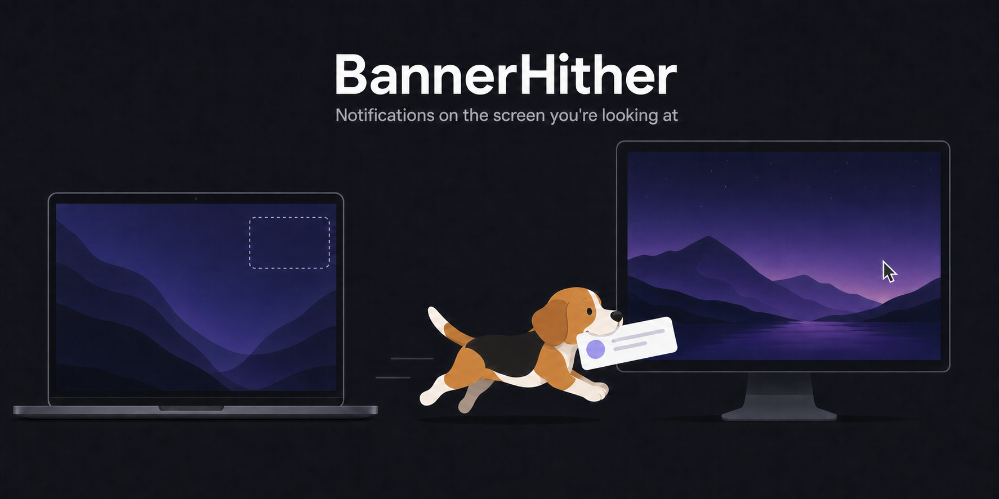

<p align="center">
  
</p>

# BannerHither

[English](../README.md) | [한국어](README.ko.md) | [日本語](README.ja.md) | 简体中文 | [Deutsch](README.de.md) | [Français](README.fr.md) | [Español](README.es.md)

[](https://github.com/KJeon10/BannerHither/actions/workflows/ci.yml)
[](../LICENSE)

BannerHither 是一个小巧的 macOS 菜单栏 App，用来决定**通知横幅出现在哪个显示器上**。macOS 总是把横幅显示在主显示器上；使用多台显示器时，那往往不是你正在看的那一台。BannerHither 会在横幅出现的瞬间，把它移到鼠标指针所在的屏幕、你正在使用的窗口所在的屏幕，或你指定的某一台显示器上。

https://github.com/user-attachments/assets/188bb329-71be-4d58-a742-c7dadd027e3e

## 安装

### 下载

1. 从 [Releases](https://github.com/KJeon10/BannerHither/releases) 页面获取 `BannerHither-<版本>.dmg`。
2. 打开镜像，把 `BannerHither.app` 拖到 Applications 快捷方式上。
3. 从“应用程序”文件夹启动。App 和镜像都已用 Developer ID 签名并经过公证，macOS 只会在首次启动时进行常规确认。

### Homebrew

```sh
brew install --cask KJeon10/tap/bannerhither
```

### 自行构建

如需自行构建，请参阅[从源码构建](#从源码构建)。

### 首次启动

BannerHither 会请求**辅助功能**权限（系统设置 › 隐私与安全性 › 辅助功能）。正是这项权限让它能够移动 NotificationCenter 的窗口。授权后引擎会自动启动；运行期间，菜单栏图标会显示为带角标的铃铛。

试试菜单里的*发送测试通知*：通知会在 3 秒后到达，这段时间足够你把鼠标移到另一台显示器上，看看横幅落在哪里。

稍后 BannerHither 会问你一个问题，只问一次：是否允许它自动检查更新。参见[更新](#更新)。

## 功能

- **鼠标指针所在的屏幕** — 横幅跟着你出现在正在使用的显示器上。
- **活跃窗口所在的屏幕** — 横幅出现在拥有焦点的窗口旁边；无法确定活跃窗口时则回退到鼠标所在的屏幕。
- **指定显示器** — 横幅始终显示在某一台显示器上。若该显示器被拔掉，则保持 macOS 的原有行为，直到它重新接入。
- **系统默认** — 什么都不做，只在菜单栏待命。
- 仅菜单栏、无程序坞图标；开始/停止开关；登录时打开；*检查更新…*和“关于”面板；带 3 秒延迟的测试通知，方便你移动鼠标；用于提交错误报告的*拷贝诊断信息*。
- 通用二进制（Apple 芯片和 Intel）；界面支持英语、韩语、日语、简体中文、德语、法语和西班牙语。
- 只需要一项权限：辅助功能。不收集数据；唯一的网络请求是可选的更新检查（见[隐私](#隐私)）。

## 路线图

不分先后。每一项都在各自的分支上开发，确认可用后再合并到 `main`。

- **注意力所在的屏幕（Attention）** — *鼠标指针所在的屏幕*和*活跃窗口所在的屏幕*都只是对你正在看哪里的猜测，在日常场景中经常猜错：鼠标停在一台显示器上，而你却在另一台上打字；或者横幅出现的那一刻，鼠标还在移向下一块屏幕的路上。新的显示位置选项会判断此刻真正吸引你注意力的显示器，把横幅放到那里。
- **位置规则** — 用一句话描述横幅该去哪里，例如“Slack 放左边的显示器，日历放我正在看的屏幕，其余的都放到最远的屏幕”，或者用条件选择器搭建同样的规则。
- **指针徽标** — 在鼠标指针或文本光标旁边显示一个小徽标，提示有通知到达，并能就地打开。如何做到既有用又绝不打扰你的工作，仍在斟酌之中。

## 更新

BannerHither 不会自行安装更新。菜单中的*检查更新…*会把你的版本与[最新发布](https://github.com/KJeon10/BannerHither/releases/latest)比较，并提供下载。经你同意后，它还会每天在后台检查一次；发现新版本时不弹出任何对话框，只在菜单中增加一项并在菜单栏图标上显示一个小点。*跳过此版本*会隐藏该版本，直到下一个版本发布。如果是通过 Homebrew 安装的，`brew upgrade --cask bannerhither` 可以完成同样的事。

## 工作原理

`NotificationCenter.app` 把所有横幅都绘制在一个透明的、与显示器同样大小的窗口里，并在每次展示横幅时把这个窗口放到主显示器上。BannerHither 通过公开的辅助功能 API 监视 NotificationCenter：当横幅窗口出现在默认位置时，App 会设置该窗口的 `AXPosition`，使其右上角与所选显示器的右上角重合，这样横幅就恰好位于 macOS 在那台显示器上原生绘制时的位置。由于移动的是整个窗口，点按、轻扫和关闭按钮都照常工作。

App 只在*状态变化*时介入（横幅刚出现，或 NotificationCenter 刚重新定位它），因此已经显示在屏幕上的横幅不会追着鼠标跑；通知中心面板（NotificationCenter 会把它放在你点按时钟的那台显示器上）也绝不会被触碰。

这依赖于 NotificationCenter 未公开的行为，Apple 可能在任何一次 macOS 更新中改变它。如果窗口无法再被找到或移动，BannerHither 会记录失败，macOS 则按原样运作；其他一切不受影响。*拷贝诊断信息*会导出当前 NotificationCenter 窗口的属性，以便从错误报告中诊断此类变化。

### 已测试的 macOS 版本

| macOS | 状态 |
| --- | --- |
| 26.6 (Tahoe) | 已验证：能找到并移动横幅窗口，NotificationCenter 重启后可恢复 |
| 14.0 – 15.x | 可编译且应能正常工作（窗口结构自 Big Sur 以来保持稳定），但尚未验证 |

### 已知限制

- 如果目标显示器比横幅窗口原本适配的显示器更窄，窗口会超出该显示器的左边缘。横幅本身仍完整可见；如果在意，可用下文的 `resizeToTargetScreen` 选项先调整窗口大小。
- 镜像其他显示器的显示器不是独立的目标。
- 尚未在关闭*显示器具有单独空间*、使用台前调度或锁定屏幕的情况下测试。

## 常见问题

**为什么通知出现在错误的显示器上？**
macOS 只会把通知横幅显示在主显示器上（“系统设置 › 显示器”中带有菜单栏的那一台），不管鼠标指针或活跃窗口在哪里。只要你在另一块屏幕上工作，通知就每次都出现在错误的屏幕上。BannerHither 会把每条横幅移到你正在看的屏幕。

**能在第二台显示器或外接显示器上收到通知吗？**
可以。选择“鼠标指针所在的屏幕”或“活跃窗口所在的屏幕”，或者用“指定显示器”把外接显示器设为固定目标。其他设置都不会改变，横幅就会出现在第二台显示器上。

**为什么不直接在“系统设置 › 显示器”里把菜单栏拖到另一台显示器？**
那样会把另一台显示器变成主显示器，程序坞、新窗口的默认位置和主空间也会一起搬过去；而且这是固定的选择，不会随你在屏幕之间切换。BannerHither 不改动显示器排列，只移动横幅。

**通知本身会被改动吗？**
不会。移动的是整个 NotificationCenter 窗口，点击、滑动和通知操作都照常可用，也不会读取通知内容。从时钟打开的通知中心面板同样不受影响。

**支持哪些 macOS 版本？**
macOS 14 Sonoma 及更高版本，已在 macOS 26 Tahoe 上验证（见上方已验证版本表）。

## 高级设置

菜单里的所有设置都保存在 `io.github.kjeon10.BannerHither` 下的 `UserDefaults` 中。有三个选项没有菜单项：

| 键 | 默认值 | 含义 |
| --- | --- | --- |
| `pollIntervalMilliseconds` | `1000` | 兜底轮询间隔。App 由辅助功能事件驱动；轮询只用于弥补漏掉的事件和 NotificationCenter 重启。`0` 表示关闭轮询（接受 50–5000）。 |
| `resizeToTargetScreen` | `false` | 移动之前，先把横幅窗口调整为目标显示器的大小。 |
| `updateFeedURL` | 未设置 | 替代的发布信息源，JSON 结构与 GitHub 的 `releases/latest` 相同，例如一个本地文件，用于测试更新检查。仅在启动时读取一次。 |

```sh
defaults write io.github.kjeon10.BannerHither pollIntervalMilliseconds -int 500
defaults write io.github.kjeon10.BannerHither resizeToTargetScreen -bool true
```

更改从下一条横幅开始生效。要跟踪 App 的动作：

```sh
log stream --predicate 'subsystem == "io.github.kjeon10.BannerHither"' --level debug
```

## 从源码构建

要求：macOS 14 或更高版本，Xcode 16 或更高版本（或对应的 Command Line Tools）。

```sh
git clone https://github.com/KJeon10/BannerHither.git
cd BannerHither
make build          # → build/BannerHither.app
open build/BannerHither.app
```

按提示允许辅助功能权限即可。

## 隐私

BannerHither 不读取通知内容。它唯一的网络请求是更新检查：经你同意后每天一次，以及在你选择*检查更新…*时，从 `api.github.com` 获取最新发布的版本号。该请求只包含 App 名称和版本；与任何 HTTPS 连接一样，GitHub 会看到你的 IP 地址。自动检查在你允许之前保持关闭，随时可以在菜单中再次关闭。如果你愿意，也可以[从源码自行构建](#从源码构建)。

## 致谢

参考了 [PingPlace](https://github.com/NotWadeGrimridge/PingPlace)、[ShoveIt](https://github.com/JaysonRawlins/ShoveIt) 和 [NotificationNanny](https://github.com/chessper53/NotificationNanny)。

## 许可证

[MIT](../LICENSE) © 2026 [KJeon10](https://github.com/KJeon10)
